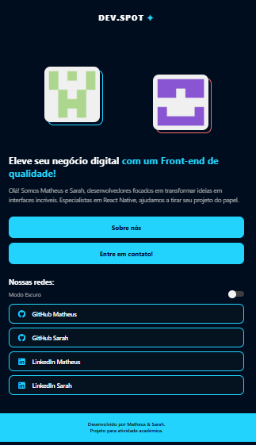
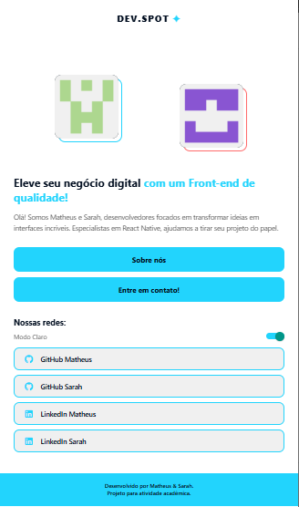
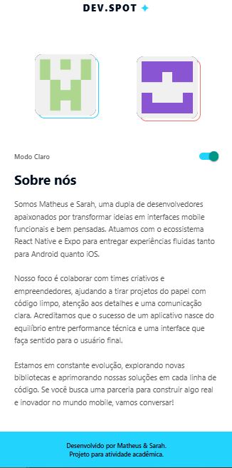
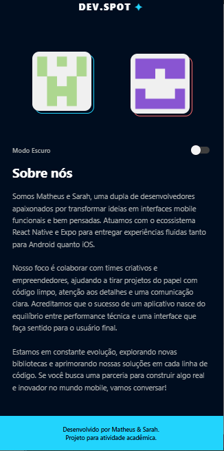

# ✦ DEV.SPOT - Portfólio Mobile

App desenvolvido para a Atividade Bimestral da disciplina de Desenvolvimento Mobile. O projeto consiste em um portfólio de dupla utilizando **React Native** e **Expo**, com foco em estruturação de componentes, navegação e estilização.

---

## 👥 Integrantes do Grupo
* **Matheus Prazeres** - [GitHub](https://github.com/MathzLabs)
* **Sarah Beatriz** - [GitHub](https://github.com/SarahBea11)


---

## 🚀 Sobre o App
O **DEV.SPOT** é um aplicativo de portfólio moderno que apresenta a identidade visual da dupla de desenvolvedores. Ele conta com:

* **Home Screen:** Apresentação da dupla com moldura dupla personalizada.
* **About Screen:** Biografia detalhada sobre a trajetória dos desenvolvedores.
* **Modo Escuro/Claro:** Alternância de tema via Switch (Diferencial).
* **Links Reais:** Integração com o `Linking` para abrir GitHub e LinkedIn externos (Diferencial).
* **Componentização:** Uso de botões sociais reutilizáveis.

---

## 📸 Screenshots
| Home (Dark Mode) | Home (White Mode) | About (White Mode) | About Dark (Dark Mode) |
| :---: | :---: | :---: | :---: |
|  |  |  | 

>

---

## 🛠️ Tecnologias Utilizadas
* [React Native](https://reactnative.dev/)
* [Expo](https://expo.dev/)
* [React Navigation](https://reactnavigation.org/)
* [Vector Icons](https://icons.expo.fyi/)
* [StyleSheet](https://reactnative.dev/docs/stylesheet)

---

## 📂 Estrutura de Pastas
```text
/
├── src/
│   ├── components/                 SocialButton
│   ├── screens/ AboutScreen & HomeScreen
│   └── assets/
├── App.js 
└── package.json 
``` 
---

## Como rodar o projeto

Clone o repositório: 

No Bash
```text
git clone https://github.com/MathzLabs/Atividade-Bimestral-React-Native.git
```
Entre na pasta:

Bash
```text
cd Atividade-Bimestral-React-Native
```
Instale as dependências:

Bash
```text
npm install
```
Inicie o Expo:

Bash
```text
npx expo start
```
Escaneie o QR Code com o app Expo Go (Android) ou a câmera (iOS).

Desenvolvido com para fins acadêmicos.